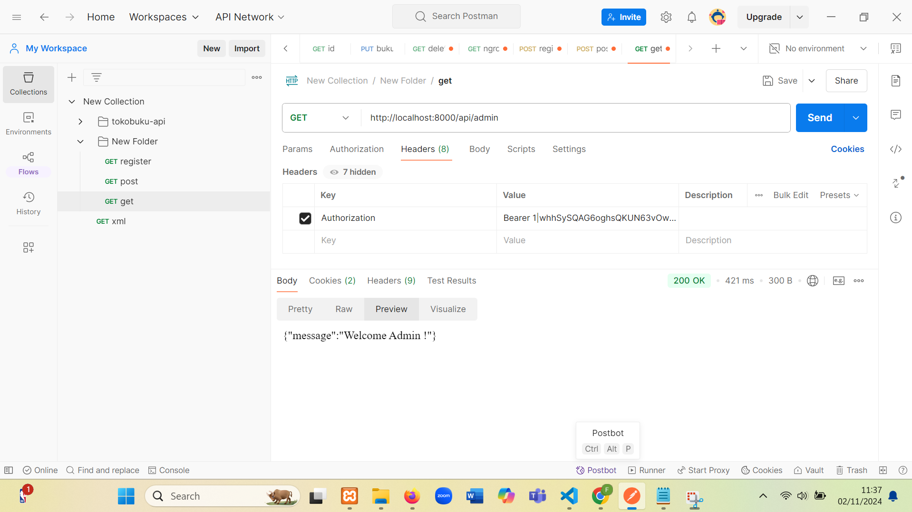
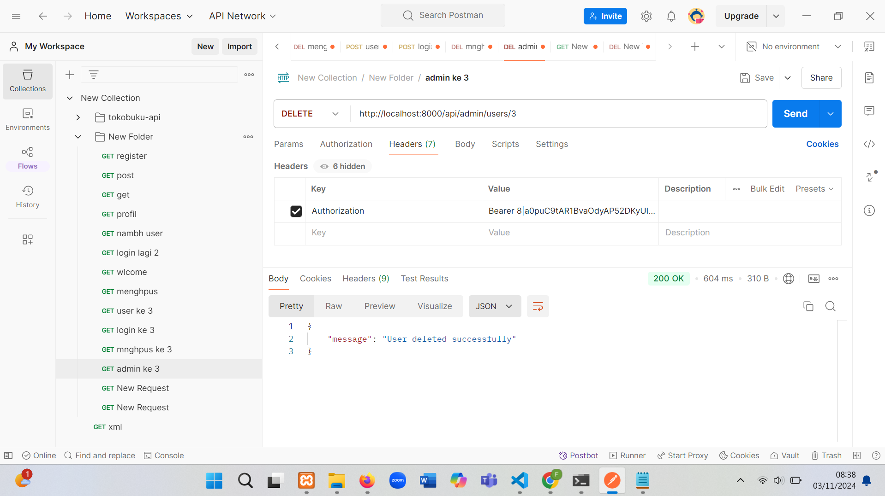

pertanyaan evaluasi

1. Apa yang dimaksud dengan Laravel Sanctum?
   Laravel Sanctum adalah paket Laravel yang menyediakan autentikasi berbasis token yang sederhana untuk aplikasi SPA (Single Page Application), aplikasi mobile, dan API berbasis token. Sanctum memungkinkan setiap pengguna aplikasi memiliki beberapa token autentikasi, yang dapat digunakan untuk mengakses layanan secara aman. Setiap token bisa diberikan hak akses tertentu, yang memungkinkan pembatasan akses berdasarkan kebutuhan pengguna atau aplikasi.

2. Bagaimana cara mengelola token autentikasi di Laravel?

    - Instal Sanctum: Pastikan Sanctum sudah diinstal dalam aplikasi Laravel Anda. Biasanya dengan menjalankan:
      composer require laravel/sanctum
      php artisan vendor:publish --provider="Laravel\Sanctum\SanctumServiceProvider"
      php artisan migrate

    - Konfigurasi Middleware: Tambahkan Sanctum sebagai middleware di config/sanctum.php dan di kernel.php untuk API yang akan dilindungi.

    - Generate Token: Untuk autentikasi berbasis token, Anda bisa membuat token menggunakan metode createToken() pada model pengguna. Contoh:
      $token = $user->createToken('token-name')->plainTextToken;

    - Autentikasi Permintaan: Setiap permintaan API yang membutuhkan autentikasi harus menyertakan header Authorization dengan nilai Bearer <token>.

    - Hapus atau Kelola Token: Anda bisa menghapus token tertentu atau semua token pengguna dengan:
      $user->tokens()->delete(); // Menghapus semua token

3. Sebutkan langkah-langkah untuk menambahkan otorisasi berbasis peran dalam API!

    - Tambahkan Kolom Peran di Tabel Pengguna: Pastikan tabel pengguna memiliki kolom role atau sejenisnya untuk menyimpan peran, seperti "admin", "user", atau "moderator".

    - Definisikan Peran di Model User: Tambahkan fungsi di model User untuk memudahkan pengecekan peran:
      public function hasRole($role) {
      return $this->role === $role;
      }

    - Buat Middleware untuk Peran: Anda bisa membuat middleware yang memeriksa apakah pengguna memiliki peran tertentu. Jalankan:
      php artisan make:middleware RoleMiddleware

    dalam middleware, tambahkan logika untuk mengecek peran:
    public function handle($request, Closure $next, $role)
    {
    if (auth()->user()->role !== $role) {
        return response()->json(['message' => 'Unauthorized'], 403);
    }
    return $next($request);
    }

    - Daftarkan Middleware: Tambahkan middleware di kernel.php agar dapat digunakan di route API.
      'role' => \App\Http\Middleware\RoleMiddleware::class,

    - Gunakan Middleware pada Route: Terapkan middleware ini pada route yang memerlukan otorisasi peran tertentu.
      Route::get('/admin-area', function () {
      // Route khusus admin
      })->middleware('auth:sanctum', 'role:admin');

    - Pengaturan Permission Lebih Detail (Opsional): Jika peran-peran memiliki izin spesifik yang berbeda, Anda bisa mengatur izin peran di tabel terpisah atau menggunakan package seperti spatie/laravel-permission untuk otorisasi yang lebih kompleks.

Tugas Praktikum

1. Tambahkan fitur untuk memperbarui profil pengguna
   

2. Implementasikan sistem untuk menghapus pengguna dengan otorisasi admin
   

3. Buat API untuk mengambil daftar semua pengguna (hanya bisa diakses oleh admin)
   
